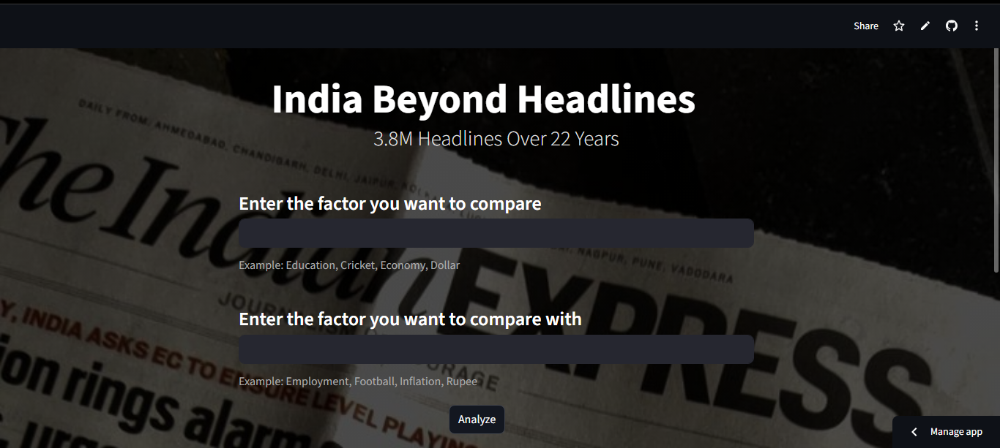
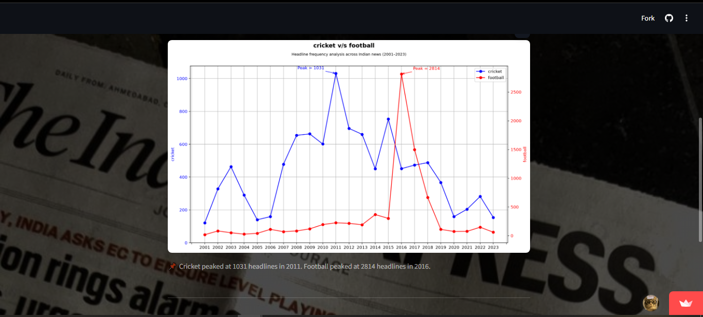

# India Beyond Headlines

> How topics trend across 22 years in the Indian news.
> Built in a day — learning Streamlit from scratch, integrating a 3.8 million row dataset, and deploying it live. All in one sitting.

A data analysis web app that lets you compare how often any two topics appeared in Indian news headlines between 2001 and 2023, across 3.8 million real headlines.

---

## Live Demo

🔗 [india-beyond-headlines.streamlit.app](https://india-beyond-headlines.streamlit.app)




---

## What It Does

**India Beyond Headlines** is an interactive data analysis web application that lets any user — regardless of technical background — explore 22 years of Indian news coverage through a simple, intuitive interface.

### The Core Idea

At its heart, the app answers one question: *how much did the Indian media talk about any given topic, and how did that change over time?*

You type any two topics you want to compare — `education` and `employment`, `cricket` and `football`, `economy` and `inflation`, `modi` and `gandhi` — and the app does the rest. It searches through 3,876,557 real Indian news headlines published between January 2001 and mid-2023, counts how many headlines mentioned each topic in every single year, and plots both trends on a dual-axis line graph so you can compare them side by side regardless of scale.

### How It Works — Step by Step

**1. User Input**

The user lands on the web app and is presented with two text input fields. The first asks for a base topic to analyze, the second asks for a topic to compare it against. Both fields include example suggestions — `Education, Cricket, Economy, Dollar` and `Employment, Football, Inflation, Rupee` respectively — to give the user a starting point and help them understand what kind of inputs the app expects.

Once both fields are filled, the user clicks the **Analyze** button and the app takes over.

**2. Input Validation**

Before any analysis begins, the app validates the input at two levels. First, it checks whether both fields are actually filled — if either is empty, it shows a warning and stops. Second, it checks whether the two topics are identical — comparing a topic against itself would produce a meaningless graph, so this is caught and flagged. Finally, once the analysis runs, if either topic returns zero results from the dataset — meaning it never appeared in any headline across 22 years — the app raises a clear, human-readable error message telling the user exactly which topic wasn't found and suggesting they try a different one. No crashes, no confusing tracebacks, just a clean error that guides the user forward.

**3. Data Filtering with Pandas**

The dataset is a CSV file containing 3,876,557 rows loaded into a Pandas DataFrame at app startup. When the user submits their topics, the app applies boolean masking — `str.contains()` with `case=False` — to filter the entire dataset down to only the rows where the `headline_text` column contains the user's topic. This is done independently for both topics, producing two separate filtered DataFrames.

The filtering is case-insensitive, meaning `Cricket`, `cricket`, and `CRICKET` all return the same results. This ensures the app behaves predictably regardless of how the user types their input.

**4. Year-wise Aggregation**

Once filtered, the app extracts the year from the `publish_date` column — which is stored in `YYYYMMDD` integer format — by converting it to a string and slicing the first four characters. Each filtered DataFrame then gets a new `year` column populated with these extracted values.

The app then uses `value_counts()` followed by `sort_index()` to count how many headlines mentioned each topic per year, producing a clean Series indexed by year with headline counts as values. This is the core data structure that powers the visualization.

**5. Dual-Axis Visualization with Matplotlib**

The two topics are plotted on the same graph but on separate Y-axes — the left axis for the first topic in blue, the right axis for the second topic in red. This dual-axis approach is intentional and important: since the two topics may have dramatically different scales — education might peak at over 1000 headlines while employment never crosses 120 — plotting them on a single axis would make the smaller dataset virtually invisible. The dual axis solves this by giving each topic its own scale while sharing the same X-axis of years, making the trend comparison meaningful regardless of the magnitude difference.

Both lines are plotted with circular markers at each data point, color-coded to match their respective axes. The legend, axis labels, and tick marks are all color-coded consistently — blue for the first topic, red for the second — so the visual is immediately readable without needing to reference the legend.

Peak annotations are added automatically — the highest point of each line is marked with an arrow and a label showing the exact peak value, so the user can instantly identify the year of maximum coverage for each topic without having to read individual data points.

**6. Result Display**

The completed graph renders directly inside the Streamlit web page below the input form. Beneath the graph, a caption line summarizes the key finding in plain English — for example: *"Education peaked at 1086 headlines in 2012. Employment peaked at 112 headlines in 2012."* This gives the user an immediate, readable takeaway without having to interpret the graph themselves.

Below the graph and caption, three metric cards display the dataset statistics — total headlines, years covered, and unique categories — giving the user context for the scale of the data their analysis just ran against.

---

## Findings / Interesting Comparisons to Try

| Topic 1 | Topic 2 | What you might find |
|---------|---------|-------------------|
| education | employment | A 10x gap that never closes |
| cricket | football | How India's sporting identity shifted |
| gold | petrol | Two commodities, one economic story |
| modi | gandhi | The changing face of Indian politics |

---

## Dataset

- **Source:** [India News Headlines — Kaggle](https://www.kaggle.com/datasets/therohk/india-headlines-news-dataset)
- **Size:** 3,876,557 headlines
- **Columns:** `publish_date`, `headline_category`, `headline_text`
- **Period:** January 2001 — mid 2023
- **Null values:** None

> `dataset.zip` is included in this repo (93MB). If the download fails or GitHub throttles it, download `india-news-headlines.csv` directly from the Kaggle link above and place it in the project root.

---

## How to Run Locally

**1. Clone the repo**
```bash
git clone https://github.com/NAV-ON-WINDOWS/india-analyzer.git
cd india-analyzer
```

**2. Install dependencies**
```bash
pip install -r requirements.txt
```

**3. Extract the dataset**

Unzip `dataset.zip` in the project root so `india-news-headlines.csv` is present. If you downloaded directly from Kaggle, place the CSV in the same folder as `app.py`.

**4. Run the app**
```bash
streamlit run app.py
```

---

## Tech Stack

| Tool | Purpose |
|------|---------|
| Python 3.12 | Core language |
| Pandas | Data loading, filtering, analysis |
| Matplotlib | Dual axis visualization |
| Streamlit | Web app interface |
| Zipfile | Reading compressed dataset at runtime |

---

## What I Learned

Built on my first Data Analysis project ([india-unf](https://github.com/NAV-ON-WINDOWS/india-unf)) where you could only see how 'Education' and 'Employment' trended over time — here you can compare any two topics you want, with a full interactive web interface.

Built in a single day, the fast learning curve was steep but worth it:

- Reading and validating large CSV files with zipfile and Pandas
- Boolean masking and conditional filtering across 3.8M rows
- String operations on dataframe columns
- Value counts and year-wise aggregation
- Dual-axis line plotting with peak annotations using Matplotlib
- Building and deploying a data web app with Streamlit from scratch

---

## Project Structure

```
india-analyzer/
├── app.py              # Streamlit web interface — handles UI, input, and rendering
├── main.py             # Core logic — data filtering, aggregation, and Matplotlib plotting (imported by app.py)
├── dataset.zip         # Compressed dataset (93MB)
├── requirements.txt    # Python dependencies
└── README.md           # You are here
```

## Author

Built by [Arnav](https://github.com/NAV-ON-WINDOWS) — CS fresher, first data project.  
If you found this interesting, star the repo.
